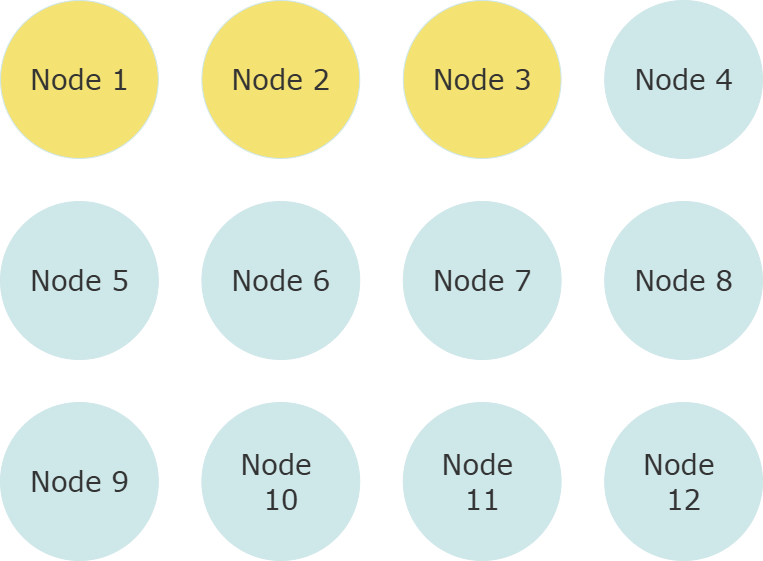
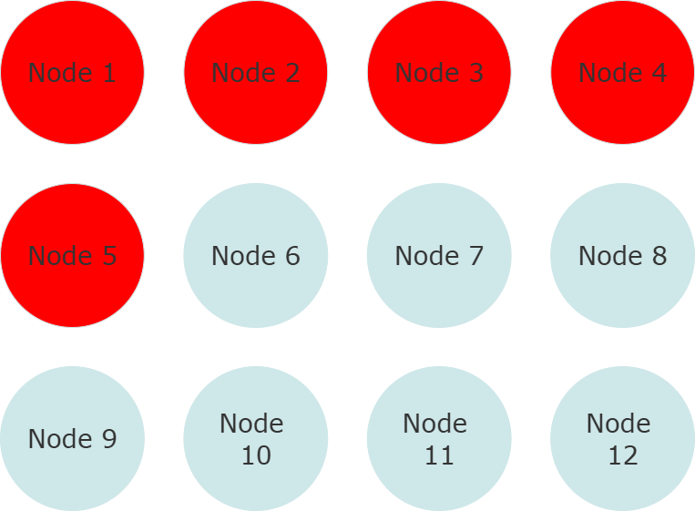
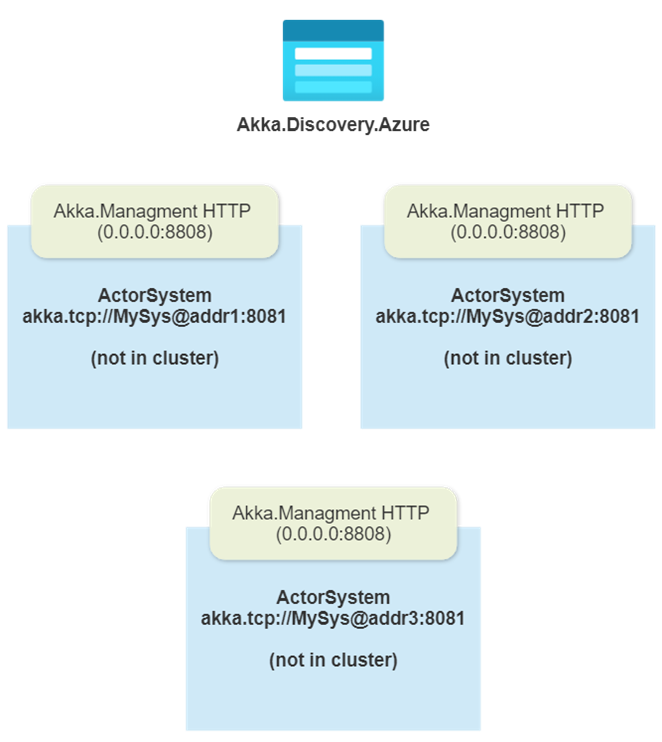
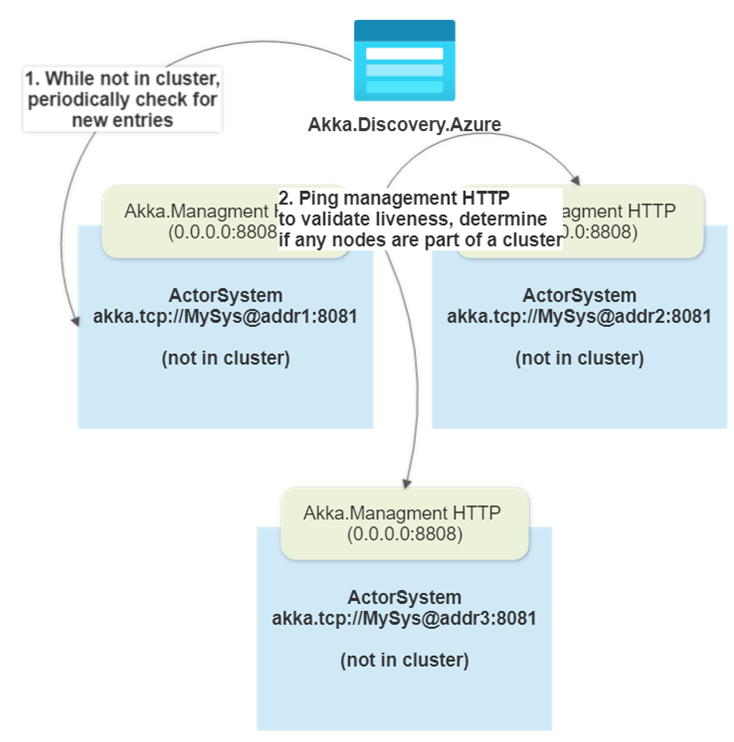
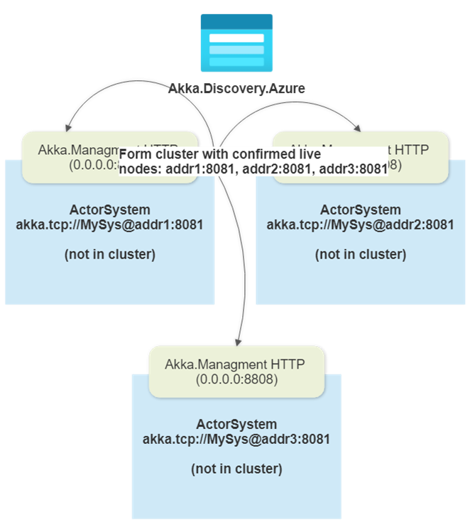
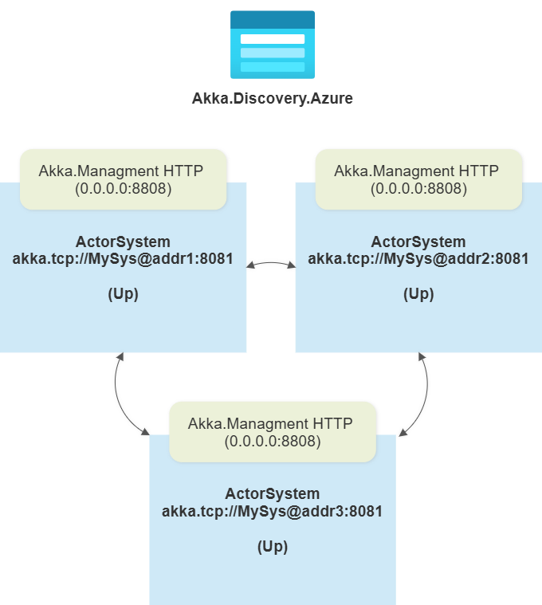

# Automatic Cluster Formation with Akka.Management

Akka.Management is a toolkit for managing and bootstrapping Akka.NET clusters in dynamic environments. It provides HTTP endpoints for cluster coordination, integrates with Akka.Discovery for service discovery, and enables safe, automated cluster formation using Cluster Bootstrap.

## Video: Form Akka.NET Clusters Dynamically with Akka.Management and Akka.Discovery

<!-- markdownlint-disable MD033 -->
<iframe width="560" height="315" src="https://www.youtube.com/embed/XCcrlhVtbKI" title="YouTube video player" frameborder="0" allow="accelerometer; autoplay; clipboard-write; encrypted-media; gyroscope; picture-in-picture; web-share" allowfullscreen></iframe>
<!-- markdownlint-enable MD033 -->

Watch this companion video for a visual walkthrough of dynamic cluster formation using Akka.Management and Akka.Discovery.

---

## How Akka.Management Works

Akka.Management exposes a set of HTTP endpoints that allow nodes to:

* Advertise their presence
* Query the status of other nodes
* Coordinate cluster formation and joining

It works in tandem with Akka.Discovery plugins (such as Azure, AWS, Kubernetes, or config-based) to dynamically discover available nodes in the environment. Cluster Bootstrap then uses this information to safely form or join a cluster, replacing the need for static seed nodes.

## Cluster Formation Process

The following images illustrate the cluster formation process with Akka.Management and Akka.Discovery:

### 1. Static Seed Nodes (Traditional)



*In the traditional model, nodes use a static list of seed nodes to form the cluster. Akka.Management is not involved; cluster formation depends on the availability of these pre-configured nodes.*

### 2. Split Brain Scenario



*If a network partition occurs, static seed nodes can lead to split-brain scenarios, where two separate clusters form. Akka.Management is not present to coordinate or prevent this; recovery is manual and error-prone.*

### 3. Dynamic Discovery Startup



*With Akka.Management enabled, nodes start up and register themselves using the configured Akka.Discovery plugin (e.g., Azure). Akka.Management exposes HTTP endpoints for each node, making them discoverable to others.*

### 4. Discovery Pinging



*Akka.Management and Cluster Bootstrap query the discovery backend for available nodes. Each node pings the HTTP endpoints of discovered peers to verify their presence and readiness to join a cluster.*

### 5. Cluster Forming



*Once the required number of contact points are verified and reachable, Akka.Management and Cluster Bootstrap coordinate the safe formation of a new cluster. Nodes agree on membership and begin the cluster join process.*

### 6. Fully Formed Cluster



*The cluster is now fully formed. Akka.Management continues to monitor node health and membership, enabling dynamic scaling and recovery as nodes join or leave the cluster.*

## Practical Usage

* **Always clear out static `SeedNodes`** when using Akka.Management and Cluster Bootstrap.
* Use a supported Akka.Discovery plugin for your environment (Azure, AWS, Kubernetes, etc.).
* Set `requiredContactPoints` to a safe value (never 1) to avoid split-brain scenarios.
* Use Akka.Hosting for modern, type-safe configuration.

## Example Configuration with Akka.Hosting

```csharp
akkaBuilder.WithRemoting("0.0.0.0", 4053);
akkaBuilder.WithClustering(new ClusterOptions
{
    SeedNodes = Array.Empty<string>(),
    Roles = new[] { "backend" }
});
akkaBuilder.WithAkkaManagement(port: 8558);
akkaBuilder.WithClusterBootstrap(
    serviceName: "my-akka-service",
    portName: "akka-remote",
    requiredContactPoints: 3
);
akkaBuilder.WithAzureDiscovery(options =>
{
    options.ServiceName = "my-akka-service";
    options.ConnectionString = "<your Azure Table Storage connection string>";
});
```

## Further Reading

* [Akka.Discovery Overview](index.md)
* [Akka.Management GitHub](https://github.com/akkadotnet/Akka.Management)
* [Form Akka.NET Clusters Dynamically with Akka.Management and Akka.Discovery (blog post)](https://petabridge.com/blog/akka-management/)
* [DrawTogether.NET Example](https://github.com/petabridge/DrawTogether.NET)
