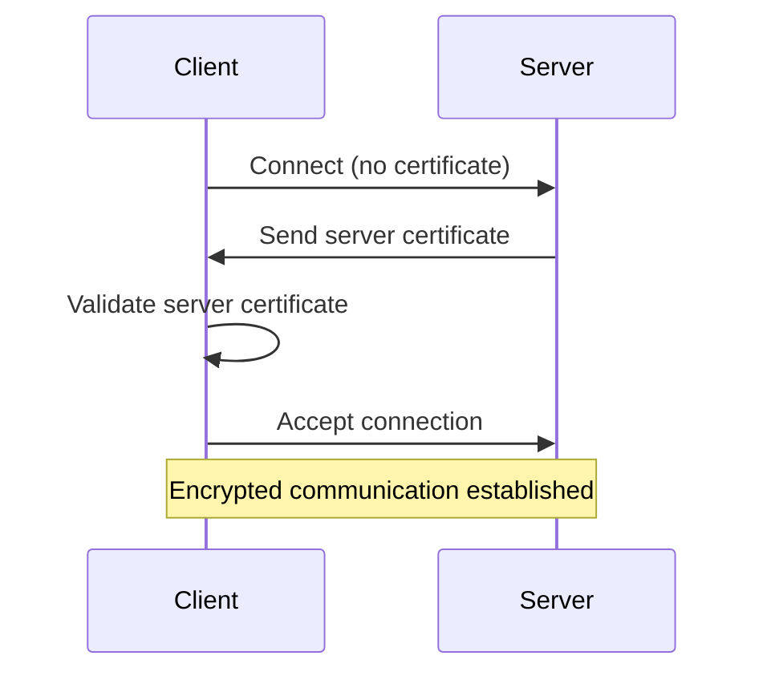
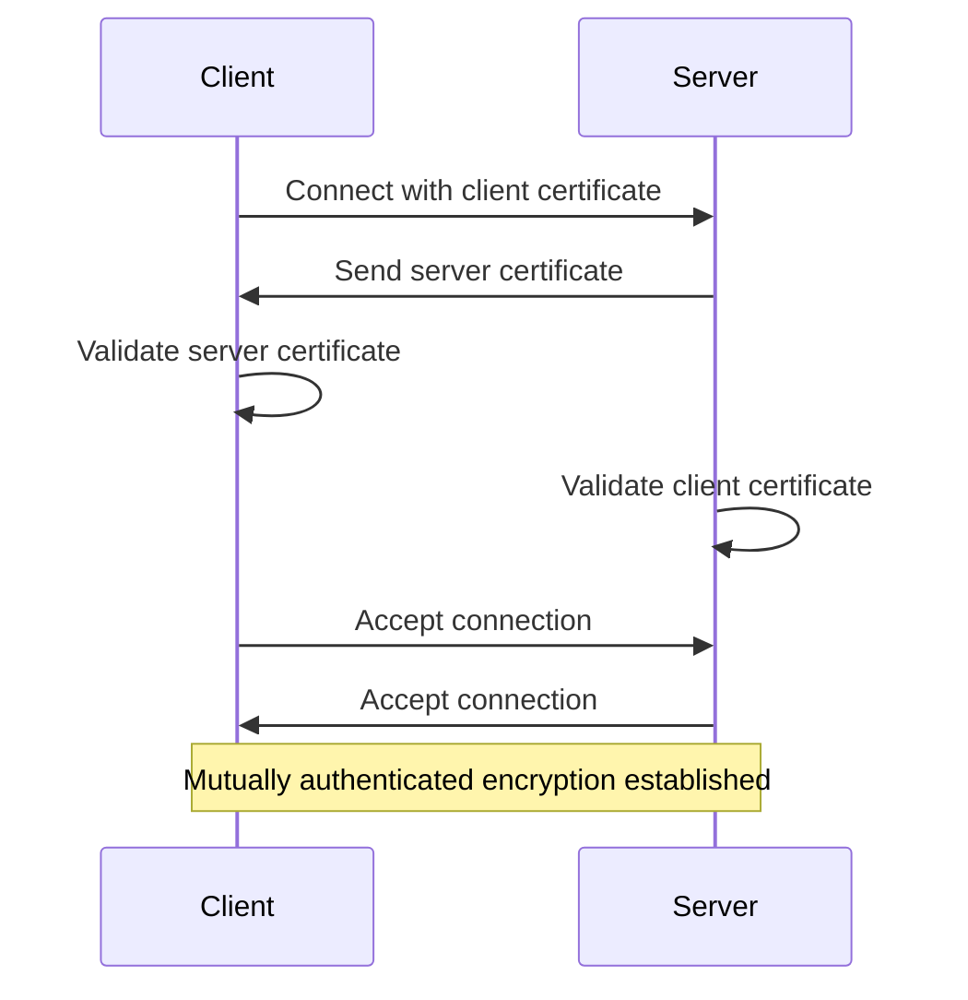

# Akka.Remote Security

## Important Context: When You Need TLS

**Akka.Remote is designed for internal cluster communication and should NOT be exposed to the public internet.** Most Akka.NET deployments run within:

* Private networks (VPNs, VPCs)
* Internal data centers
* Kubernetes clusters with network policies
* Behind firewalls with strict ingress rules

### When TLS Is Optional

For many deployments, TLS is not strictly necessary:

* Your cluster runs entirely within a trusted network boundary
* Development or staging environments where data sensitivity is low
* Kubernetes with network policies providing container-level isolation

### When TLS Is Recommended

Enable TLS when:

* Communicating between data centers or cloud regions
* Any traffic crosses public networks, even with a VPN underneath
* Compliance requirements apply (PCI-DSS, HIPAA, etc.)
* You want defense-in-depth on a private network
* Running on shared infrastructure alongside other applications

## Security Layers

Akka.Remote security operates on four complementary layers:

1. **Network Isolation** - Using VPNs or private networks to restrict which machines can reach your actor systems
2. **Transport Encryption** - Using TLS to encrypt all communication between nodes
3. **Authentication** - Using mutual TLS to verify the identity of all connecting nodes
4. **Serialization Safety** - Restricting which types can be serialized/deserialized to prevent arbitrary type injection via remote messages

In production, you want all four. Skipping any of them leaves a gap the other three can't fully cover.

## TLS (Transport Layer Security) Overview

TLS encryption was introduced in Akka.NET v1.2 with the DotNetty transport. It provides:

**What TLS Protects Against:**

* Eavesdropping (all messages are encrypted)
* Man-in-the-middle attacks (certificates verify server identity)
* Network packet injection (cryptographic integrity checks)

**What TLS Does NOT Protect Against:**

* Misconfigured certificates (see startup validation below)
* Compromised private keys (rotate certificates regularly)
* Application-level authorization (implement this separately)

## Certificate Validation: Independent Control

**New in Akka.NET v1.5.52+:** Certificate validation is split into two independent settings.

### Two Types of Validation

1. **Chain Validation** (`suppress-validation`) - Validates certificate against trusted CAs
2. **Hostname Validation** (`validate-certificate-hostname`) - Validates certificate CN/SAN matches target hostname

These settings are **independent** and can be configured separately based on your deployment scenario.

### Chain Validation

The `suppress-validation` setting controls whether the certificate chain is validated against trusted root CAs.

**Default Certificate Stores Used:**

When `suppress-validation = false`, .NET's `SslStream` validates certificates against the operating system's trusted root certificate stores:

* **Windows**: Uses the [Windows Certificate Store](https://learn.microsoft.com/en-us/windows-hardware/drivers/install/local-machine-and-current-user-certificate-stores) - specifically the `Trusted Root Certification Authorities` store
* **Linux**: Uses the system's CA bundle (typically `/etc/ssl/certs/ca-certificates.crt` or `/etc/pki/tls/certs/ca-bundle.crt`)
* **macOS**: Uses the Keychain Access Trusted Certificates

The validation process follows [RFC 5280 (X.509 PKI Certificate and CRL Profile)](https://datatracker.ietf.org/doc/html/rfc5280) and [RFC 6125 (Service Identity Verification)](https://datatracker.ietf.org/doc/html/rfc6125).

#### Enabled (Recommended)

When `suppress-validation = false` (the default when SSL is enabled):

**What it validates:**

* Certificate chain against system trusted root CAs
* Certificate expiration dates
* Certificate hasn't been revoked (if CRL/OCSP configured)

**Does NOT validate:**

* Hostname matching (see Hostname Validation section below)

**When to use:** Always in production and any networked environment.

#### Disabled (Use With Caution)

When `suppress-validation = true`:

**What it skips:**

* Certificate chain validation (accepts self-signed certificates)
* Expiration date checks
* CA trust checks

**When it's acceptable:**

* Local development on `localhost` only
* Automated testing with self-signed test certificates
* Initial TLS setup/debugging before obtaining proper certificates

**When it's NOT acceptable:**

* Any production environment
* Any network-accessible environment (dev, staging, QA)
* Any environment processing sensitive data
* Any multi-tenant environment

### Validation Strategies: HOCON vs Programmatic (v1.5.52+)

Two independent validation decisions determine your TLS security posture:

1. **Chain Validation** - Verify certificate against trusted CAs (`suppress-validation`)
2. **Hostname Validation** - Verify certificate CN/SAN matches target (`validate-certificate-hostname`)
3. **Mutual Authentication** - Require both sides authenticate (`require-mutual-authentication`)

#### Decision Matrix: Which Combination to Use

| Use Case | suppress-validation | validate-hostname | mutual-auth | Config Approach |
|----------|---------------------|-------------------|-------------|-----------------|
| **P2P Cluster (Default)** | `false` | `false` | `true` | HOCON ✓ or Programmatic |
| **Client-Server with Shared Cert** | `false` | `true` | `true` | HOCON ✓ or Programmatic |
| **Development/Testing** | `true` | `false` | `false` | HOCON only |
| **Certificate Pinning** | `false` | `false` | `true` | **Programmatic required** |
| **Custom Subject/Issuer Validation** | `false` | `false` | `true` | **Programmatic required** |

#### HOCON Configuration Approach

When `validate-certificate-hostname = false` (the default):

* Skips hostname validation
* Only validates certificate chain (if `suppress-validation = false`)
* **Best for:** Mutual TLS with per-node certificates, IP-based connections, Kubernetes dynamic discovery

When `validate-certificate-hostname = true`:

* Certificate CN (Common Name) or SAN (Subject Alternative Name) must match the target hostname
* Traditional TLS hostname validation as used in HTTPS
* **Best for:** Client-server architectures with shared certificates and stable DNS names

**HOCON Example - P2P Cluster (Common Default):**

```hocon
akka.remote.dot-netty.tcp {
  enable-ssl = true
  ssl {
    suppress-validation = false                    # Validate CA chain
    require-mutual-authentication = true           # Both sides authenticate
    validate-certificate-hostname = false          # Default: Allow per-node certs
    certificate {
      use-thumbprint-over-file = true
      thumbprint = "2531c78c51e5041d02564697a88af8bc7a7ce3e3"
    }
  }
}
```

**HOCON Example - Client-Server with Hostname Validation:**

```hocon
akka.remote.dot-netty.tcp {
  enable-ssl = true
  ssl {
    suppress-validation = false                    # Validate CA chain
    require-mutual-authentication = true           # Both sides authenticate
    validate-certificate-hostname = true           # Hostname must match
    certificate {
      use-thumbprint-over-file = true
      thumbprint = "2531c78c51e5041d02564697a88af8bc7a7ce3e3"
    }
  }
}
```

#### Programmatic Configuration Approach

Use `DotNettySslSetup` with `CertificateValidation` helpers when you need:

* **Certificate pinning** - Accept only specific certificates
* **Subject/Issuer validation** - Custom certificate attribute checks
* **Custom business logic** - Domain-specific validation rules
* **Dynamic validation** - Load rules from runtime sources

See [Programmatic Certificate Validation](#programmatic-certificate-validation-v1555) below for detailed examples.

### Self-Signed Certificates: The Right Way

If you must use self-signed certificates (development/testing):

#### Option 1: Trust the Self-Signed CA (Better)

```powershell
# Generate self-signed CA
$ca = New-SelfSignedCertificate -Subject "CN=Dev-CA" -CertStoreLocation Cert:\CurrentUser\My -KeyUsage CertSign

# Export and import to Trusted Root
Export-Certificate -Cert $ca -FilePath dev-ca.cer
Import-Certificate -FilePath dev-ca.cer -CertStoreLocation Cert:\LocalMachine\Root

# Generate server cert signed by CA
New-SelfSignedCertificate -Subject "CN=localhost" -Signer $ca -CertStoreLocation Cert:\LocalMachine\My
```

**Configuration:**

```hocon
akka.remote.dot-netty.tcp.ssl {
  suppress-validation = false  # ✓ Still validates, but trusts your CA
  certificate {
    use-thumbprint-over-file = true
    thumbprint = "server-cert-thumbprint"
  }
}
```

**Pros:**

* Maintains validation checks
* Catches expiration/configuration errors
* More realistic test environment

#### Option 2: Suppress Validation (Quick but Dangerous)

```hocon
akka.remote.dot-netty.tcp.ssl {
  suppress-validation = true  # ⚠️ Development ONLY
  certificate {
    path = "self-signed.pfx"
    password = "password"
  }
}
```

**Pros:**

* Quick setup
* No certificate installation needed

**Cons:**

* Doesn't catch real configuration errors
* False sense of security
* Easy to accidentally deploy to production

**WARNING:** Never commit `suppress-validation = true` to version control for production configs. Use environment-specific configuration files.

## Certificate Configuration

### Option 1: Certificate File (Recommended for Development)

```hocon
akka.remote.dot-netty.tcp {
  enable-ssl = true
  ssl {
    suppress-validation = false  # IMPORTANT: Never use true in production!
    certificate {
      path = "path/to/certificate.pfx"
      password = "certificate-password"
      # Optional: Specify key storage flags
      flags = [ "exportable" ]
    }
  }
}
```

**When to use:** Development, testing, containerized environments where you can mount certificate files.

**Pros:**

* Easy to deploy with containers
* Simple to version control (store path, not certificate)
* Works well with configuration management tools

**Cons:**

* Certificate files can be copied if filesystem is compromised
* Requires file system access for certificate deployment

### Option 2: Windows Certificate Store (Recommended for Production)

```hocon
akka.remote.dot-netty.tcp {
  enable-ssl = true
  ssl {
    suppress-validation = false
    certificate {
      use-thumbprint-over-file = true
      thumbprint = "2531c78c51e5041d02564697a88af8bc7a7ce3e3"
      store-name = "My"
      store-location = "local-machine"  # or "current-user"
    }
  }
}
```

**When to use:** Windows production environments, enterprise deployments with centralized certificate management.

**Pros:**

* Leverages Windows ACL for private key protection
* Integrates with enterprise PKI infrastructure
* Supports hardware security modules (HSM)
* Private keys can be marked as non-exportable

**Cons:**

* Windows-specific (not portable to Linux)
* Requires administrative access for certificate installation
* More complex initial setup

**Finding Your Thumbprint:**

1. Open `certlm.msc` (Local Machine) or `certmgr.msc` (Current User)
2. Navigate to Personal > Certificates
3. Double-click your certificate
4. Go to Details tab
5. Scroll to Thumbprint field
6. Copy the value (remove spaces)

## Programmatic Certificate Validation (v1.5.55+)

**New in Akka.NET v1.5.55:** Certificate validation can be configured programmatically via `DotNettySslSetup` and custom validators. HOCON config still works — programmatic setup just takes precedence when both are present.

### When to Use Programmatic Configuration

Use programmatic setup when you need:

* Domain-specific certificate validation rules
* Certificate pinning by thumbprint
* Subject or issuer attribute checks
* Validation rules loaded at runtime
* Multiple validators composed together

### CertificateValidation Helper Factory

The `CertificateValidation` static class provides 7 helper methods for common validation patterns:

#### Basic Chain Validation

[!code-csharp[ProgrammaticMutualTlsSetup](../../../src/core/Akka.Docs.Tests/Configuration/TlsConfigurationSample.cs?name=ProgrammaticMutualTlsSetup)]

#### Certificate Pinning by Thumbprint

Accept only certificates with specific thumbprints. Prevents man-in-the-middle attacks if CA is compromised:

[!code-csharp[CertificatePinningExample](../../../src/core/Akka.Docs.Tests/Configuration/TlsConfigurationSample.cs?name=CertificatePinningExample)]

#### Custom Validation Logic with ChainPlusThen

Perform standard chain validation, then apply custom business logic:

[!code-csharp[CustomValidationLogicExample](../../../src/core/Akka.Docs.Tests/Configuration/TlsConfigurationSample.cs?name=CustomValidationLogicExample)]

#### Hostname Validation

Enable traditional TLS hostname validation (certificate CN/SAN must match target hostname). Use for client-server architectures with shared certificates:

[!code-csharp[HostnameValidationExample](../../../src/core/Akka.Docs.Tests/Configuration/TlsConfigurationSample.cs?name=HostnameValidationExample)]

#### Subject DN Validation

Accept only certificates with specific subject names:

[!code-csharp[SubjectValidationExample](../../../src/core/Akka.Docs.Tests/Configuration/TlsConfigurationSample.cs?name=SubjectValidationExample)]

### CertificateValidation Helper Methods

| Method | Purpose |
|--------|---------|
| `ValidateChain()` | CA chain validation with full error details |
| `ValidateHostname()` | Traditional TLS hostname validation (CN/SAN matching) |
| `PinnedCertificate()` | Certificate pinning by thumbprint whitelist |
| `ValidateSubject()` | Subject DN pattern matching (e.g., CN, O, OU) |
| `ValidateIssuer()` | Issuer DN pattern matching |
| `Combine()` | Compose multiple validators (AND logic) |
| `ChainPlusThen()` | Chain validation + custom business logic |

### Custom Validator Precedence

When both custom validators and HOCON config are present, custom validators take precedence:

```csharp
// This validator will be used regardless of HOCON suppress-validation setting
var customValidator = CertificateValidation.ValidateChain(log);
var sslSetup = new DotNettySslSetup(
    certificate: cert,
    suppressValidation: false,  // Ignored when customValidator provided
    customValidator: customValidator
);
```

If a custom validator is set, it wins regardless of what `suppress-validation` says in HOCON.

## Startup Certificate Validation (v1.5.52+)

**New in Akka.NET v1.5.52:** The transport now validates certificate configuration at startup, preventing runtime failures.

### What It Validates

The startup validation verifies:

* Certificate exists in the specified location
* Certificate has a private key associated
* Application has permissions to access the private key
* Private key is accessible for both RSA and ECDSA algorithms

Better to catch a bad certificate at startup than mid-handshake on a live connection.

### Common Private Key Permission Issues

**Symptom:** "SSL certificate private key exists but cannot be accessed"

**Cause:** Application user lacks permissions to the private key file in Windows certificate store.

**Solution:** Grant private key access to your application user:

```powershell
# Find the certificate
$cert = Get-ChildItem Cert:\LocalMachine\My | Where-Object {$_.Thumbprint -eq "YOUR_THUMBPRINT"}

# Get private key file location
$keyPath = $cert.PrivateKey.CspKeyContainerInfo.UniqueKeyContainerName
$keyFullPath = "C:\ProgramData\Microsoft\Crypto\RSA\MachineKeys\$keyPath"

# Grant read permissions
$acl = Get-Acl $keyFullPath
$permission = "DOMAIN\AppUser","Read","Allow"
$accessRule = New-Object System.Security.AccessControl.FileSystemAccessRule $permission
$acl.AddAccessRule($accessRule)
Set-Acl $keyFullPath $acl
```

## Understanding Mutual TLS (mTLS) vs Standard TLS (v1.5.52+)

Akka.NET supports both standard TLS and mutual TLS (mTLS), configured via the `require-mutual-authentication` setting in the [Validation Strategies](#validation-strategies-hocon-vs-programmatic-v1552) section above.

### Visual Comparison

**Standard TLS (Server Authentication Only):**



**Mutual TLS (Client + Server Authentication):**



### When to Enable Mutual TLS

Enable it (`require-mutual-authentication = true`) when:

* All nodes are under your control — this is the typical Akka.NET cluster setup, and the recommendation
* Compliance requires bidirectional authentication (PCI-DSS, HIPAA, etc.)
* You want to prevent misconfigured nodes from joining the cluster

Disable it (`require-mutual-authentication = false`) when:

* Clients can't provide certificates (rare in Akka.NET)
* You're running a client-server architecture where clients are untrusted
* Backward compatibility with older clients is required

The default is `true` since v1.5.52.

### Security Benefits of Mutual TLS

**Asymmetric connectivity protection.** Without mTLS, a node with a broken certificate can still connect *out* to the cluster (client TLS succeeds even if the server cert is bad). With mTLS, it can't connect at all.

**Defense-in-depth.** Startup validation catches broken server configs; mTLS catches broken clients. Together they cover both directions.

**Real identity verification.** Every node must prove it holds the private key — not just that it has a copy of the certificate. An attacker who steals a cert file but not the private key gets nothing.

For configuration examples in both HOCON and programmatic styles, see [Validation Strategies](#validation-strategies-hocon-vs-programmatic-v1552) and [Programmatic Certificate Validation](#programmatic-certificate-validation-v1555) sections above.

## Configuration Examples and Security Analysis

Concrete examples with security tradeoffs for each configuration level.

### HOCON Configuration Security Levels

**Development/Testing Only (INSECURE):**

[!code-csharp[DevTlsConfig](../../../src/core/Akka.Docs.Tests/Configuration/TlsConfigurationSample.cs?name=DevTlsConfig)]

* ⚠️ `suppress-validation = true` accepts ANY certificate (self-signed, expired, invalid chains)
* Vulnerable to man-in-the-middle attacks
* No client authentication
* **Use only:** Local development, never in networked environments

**Standard TLS (Medium-High Security):**

[!code-csharp[StandardTlsConfig](../../../src/core/Akka.Docs.Tests/Configuration/TlsConfigurationSample.cs?name=StandardTlsConfig)]

* Server proves identity to clients
* All traffic encrypted
* Startup validation prevents misconfigurations
* **Use when:** Mutual TLS is not feasible

**Mutual TLS with Windows Certificate Store (Maximum Security - RECOMMENDED):**

[!code-csharp[WindowsCertStoreConfig](../../../src/core/Akka.Docs.Tests/Configuration/TlsConfigurationSample.cs?name=WindowsCertStoreConfig)]

* ✓ Both client and server prove identity
* ✓ All traffic encrypted
* ✓ Prevents misconfigured nodes from connecting
* ✓ Private keys protected by Windows ACL
* **Use when:** Production Akka.NET clusters (default recommended configuration)

**Mutual TLS for P2P Clusters with Per-Node Certificates:**

Refer to the [Validation Strategies](#validation-strategies-hocon-vs-programmatic-v1552) section for HOCON example showing P2P cluster setup.

**Client-Server with Hostname Validation:**

Refer to the [Validation Strategies](#validation-strategies-hocon-vs-programmatic-v1552) section for HOCON example with hostname validation enabled.

### Programmatic Configuration Security Levels

For certificate pinning, subject/issuer validation, or custom logic, use programmatic setup:

[!code-csharp[ProgrammaticMutualTlsSetup](../../../src/core/Akka.Docs.Tests/Configuration/TlsConfigurationSample.cs?name=ProgrammaticMutualTlsSetup)]

[!code-csharp[CertificatePinningExample](../../../src/core/Akka.Docs.Tests/Configuration/TlsConfigurationSample.cs?name=CertificatePinningExample)]

See [Programmatic Certificate Validation](#programmatic-certificate-validation-v1555) section for more examples.

## Untrusted Mode

In addition to TLS, Akka.Remote supports "untrusted mode" which prevents clients from sending system-level messages:

```hocon
akka.remote {
  untrusted-mode = true

  # Whitelist specific actors that can receive remote messages
  trusted-selection-paths = [
    "/user/api-handler",
    "/user/public-endpoint"
  ]
}
```

**When to enable:**

* You're exposing Akka.Remote to untrusted clients
* You want to prevent remote actor creation/supervision
* Defense against malicious remote commands

**Note:** This does NOT replace TLS encryption. Use both together.

## Serialization Security

Every message Akka.Remote sends goes through serialization. When a type has no explicit serializer binding, Akka.NET silently falls back to the `System.Object` serializer (Newtonsoft.Json). On an open network that's a problem: an attacker who can reach your endpoint can send messages that cause arbitrary types to be deserialized.

Disable the fallback in v1.5.66+:

```hocon
akka.actor.serialization-settings.allow-unregistered-types = false
```

With this set, Akka.NET throws a `SerializationException` for any unregistered type instead of silently falling back to JSON. Turn it on in production.

> [!NOTE]
> Full details — including Hyperion's built-in dangerous-type blacklist and schema-based serialization recommendations — are covered in [Serialization Security](xref:serialization#serialization-security).

## Virtual Private Networks (VPNs)

The most reliable security measure is a network that attackers can't reach in the first place. Run Akka.Remote on private networks that require VPN access.

**Why VPNs matter:**

* Restricts who can even attempt to connect
* Provides network-level access control
* Adds authentication layer before TLS
* Protects against network scanning/discovery

### VPN Options

**Self-Hosted:**

* [WireGuard](https://www.wireguard.com/) - Modern, fast, simple to configure
* [OpenVPN](https://openvpn.net/) - Mature, widely supported

**Cloud Provider VPNs:**

* [AWS Virtual Private Cloud (VPC)](https://aws.amazon.com/vpc/)
* [Azure Virtual Networks (VNet)](https://azure.microsoft.com/en-us/services/virtual-network/)
* [Google Cloud VPC](https://cloud.google.com/vpc)

**Managed Solutions:**

* [Tailscale](https://tailscale.com/) - Zero-config VPN mesh networking
* [ZeroTier](https://www.zerotier.com/) - Software-defined networking

## Troubleshooting

### Error: "SSL Certificate Private Key Exists but Cannot Be Accessed"

**Cause:** Application lacks permissions to private key file.

**Fix:** Run PowerShell script above to grant permissions.

### Error: "The Remote Certificate Is Invalid According to the Validation Procedure"

**Cause:** Certificate validation failed (expired, wrong CA, hostname mismatch).

**Fix:**

* Verify certificate is not expired: `Get-ChildItem Cert:\LocalMachine\My`
* Check certificate CN/SAN matches hostname
* For testing only: Set `suppress-validation = true` to identify if it's a validation issue

### Error: "TLS Handshake Failed" with No Client Certificate

**Cause:** Server requires mutual TLS but client didn't provide certificate.

**Fix:**

* Ensure all nodes have `require-mutual-authentication` set consistently
* Verify client certificate is configured correctly
* Check client application has private key access

### Error: "RemoteCertificateNameMismatch" - Hostname Validation Failure

**Full error message:**

```text
TLS certificate validation failed (full validation):
  - Certificate name mismatch
    - RemoteCertificateNameMismatch: The hostname being connected to does not match
      the hostname(s) on the server certificate.

Certificate Details:
  Subject: CN=node1.example.com
  Issuer: CN=My-CA
  Valid: 2025-01-01 to 2026-01-01

Connection target: 192.168.1.100:4053
```

**Cause:** Certificate CN/SAN doesn't match the target hostname/IP address.

**Common scenarios:**

1. **Connecting via IP but certificate has DNS name**
   * Connecting to: `192.168.1.100`
   * Certificate CN: `node1.example.com`

2. **Per-node certificates in P2P cluster**
   * Node A cert CN: `node-a.cluster.local`
   * Node B cert CN: `node-b.cluster.local`
   * Each node's certificate doesn't match the other node's hostname

**Fix:**

Option 1 (Recommended for P2P clusters): Disable hostname validation

```hocon
akka.remote.dot-netty.tcp.ssl {
  validate-certificate-hostname = false  # Allow per-node certs
}
```

Option 2: Use certificates with matching CN/SAN

```bash
# Ensure certificate CN matches connection target
# For IP connections, add IP SAN to certificate:
New-SelfSignedCertificate -Subject "CN=node1" `
  -DnsName "node1", "node1.example.com" `
  -TextExtension @("2.5.29.17={text}IPAddress=192.168.1.100")
```

Option 3: Connect via DNS names that match certificate CN

```hocon
akka.remote.dot-netty.tcp {
  hostname = "node1.example.com"  # Must match cert CN
}
```

### Error: "UntrustedRoot" - Certificate Chain Validation Failure

**Full error message:**

```text
TLS/SSL certificate validation failed:
  - Certificate chain validation errors
    - UntrustedRoot: A certificate chain processed, but terminated in a root
      certificate which is not trusted by the trust provider.

Certificate Details:
  Subject: CN=localhost
  Issuer: CN=localhost (self-signed)
```

**Cause:** Certificate is self-signed or signed by untrusted CA.

**Fix:**

Option 1 (Development only): Suppress chain validation

```hocon
akka.remote.dot-netty.tcp.ssl {
  suppress-validation = true  # WARNING: Development only!
}
```

Option 2 (Recommended): Trust the CA certificate

```powershell
# Windows: Import CA to Trusted Root store
Import-Certificate -FilePath ca.cer -CertStoreLocation Cert:\LocalMachine\Root

# Linux: Add to system CA bundle
sudo cp ca.crt /usr/local/share/ca-certificates/
sudo update-ca-certificates
```

### Understanding TLS Error Messages (v1.5.52+)

Since v1.5.52, TLS handshake failures provide detailed diagnostic information including:

* **Error category** (chain validation, hostname mismatch, etc.)
* **Specific SSL policy error** with explanation
* **Certificate details** (subject, issuer, validity period)
* **Connection context** (local/remote addresses)
* **Actionable recommendations**

**Example comprehensive error:**

```text
TLS handshake failed on channel [127.0.0.1:4053->127.0.0.1:54321](Id=...)

Detailed TLS Error:
  - Certificate chain validation errors
    - UntrustedRoot: A certificate chain processed, but terminated in a root
      certificate which is not trusted by the trust provider.
  - Certificate name mismatch
    - RemoteCertificateNameMismatch: The hostname being connected to does not
      match the hostname(s) on the server certificate.

Certificate Information:
  Subject: CN=node-test
  Issuer: CN=node-test (self-signed)
  Serial Number: 1A2B3C4D5E6F
  Valid From: 2025-01-01 00:00:00 UTC
  Valid To: 2026-01-01 00:00:00 UTC
  Thumbprint: 2531c78c51e5041d02564697a88af8bc7a7ce3e3

Recommendations:
  - For development: Set 'suppress-validation = true' (testing only!)
  - For production: Install certificate in trusted root store
  - For hostname issues: Set 'validate-certificate-hostname = false' if using
    per-node certificates or IP-based connections
```

## Additional Resources

* [Windows Firewall Configuration Best Practices](https://learn.microsoft.com/en-us/windows/security/operating-system-security/network-security/windows-firewall/best-practices-configuring)
* [TLS 1.2 Specification (RFC 5246)](https://datatracker.ietf.org/doc/html/rfc5246)
* [OWASP Transport Layer Security Cheat Sheet](https://cheatsheetseries.owasp.org/cheatsheets/Transport_Layer_Security_Cheat_Sheet.html)

---

**Related:**

* [Akka.Remote Configuration](xref:akka-remote-configuration)
* [DotNetty Transport](https://github.com/Azure/DotNetty)
* [Serialization Security](xref:serialization#serialization-security) - Controlling which types can be serialized/deserialized over the wire
