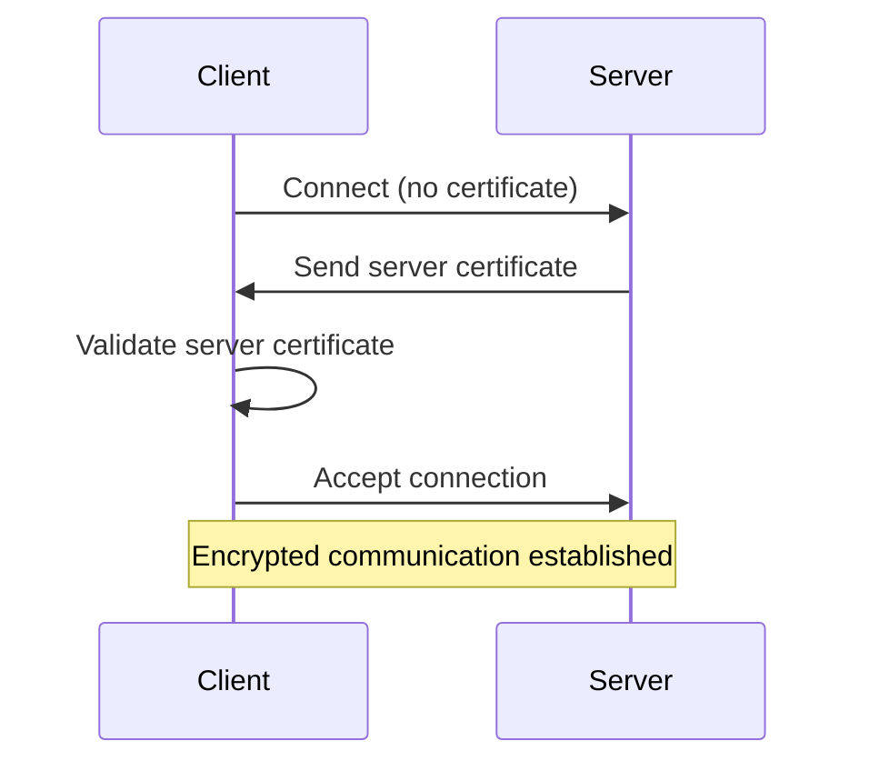
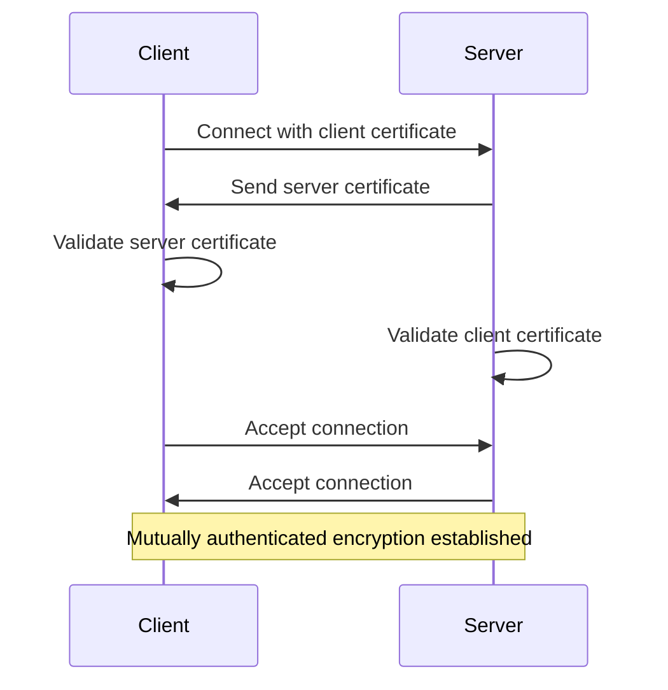

# Akka.Remote Security

## Important Context: When You Need TLS

**Akka.Remote is designed for internal cluster communication and should NOT be exposed to the public internet.** Most Akka.NET deployments run within:

* Private networks (VPNs, VPCs)
* Internal data centers
* Kubernetes clusters with network policies
* Behind firewalls with strict ingress rules

### When TLS Is Optional

For many deployments, TLS is not strictly necessary:

* ✅ **Internal networks only** - If your cluster runs entirely within a trusted network boundary
* ✅ **Development/staging environments** - Where data sensitivity is low
* ✅ **Kubernetes with network policies** - Where the container network provides isolation

### When TLS Is Recommended

You should enable TLS when:

* 🔒 **Crossing network boundaries** - Communication between data centers or cloud regions
* 🔒 **Public internet transit** - Any traffic over public networks (even with VPN)
* 🔒 **Compliance requirements** - PCI-DSS, HIPAA, or other regulatory needs
* 🔒 **Defense-in-depth** - Additional security layer even on private networks
* 🔒 **Multi-tenant environments** - Shared infrastructure with other applications

## Security Layers

Akka.Remote security operates on three complementary layers:

1. **Network Isolation** - Using VPNs or private networks to restrict which machines can reach your actor systems
2. **Transport Encryption** - Using TLS to encrypt all communication between nodes
3. **Authentication** - Using mutual TLS to verify the identity of all connecting nodes

You should use **all three layers** in production for defense-in-depth security.

## TLS (Transport Layer Security) Overview

TLS encryption was introduced in Akka.NET v1.2 with the DotNetty transport. It provides:

✅ **What TLS Protects Against:**

* Eavesdropping (all messages are encrypted)
* Man-in-the-middle attacks (certificates verify server identity)
* Network packet injection (cryptographic integrity checks)

❌ **What TLS Does NOT Protect Against:**

* Misconfigured certificates (see startup validation below)
* Compromised private keys (rotate certificates regularly)
* Application-level authorization (implement this separately)

## Certificate Validation: Suppress-Validation Setting

The `suppress-validation` setting controls whether certificate validation is enforced during TLS handshakes.

### Suppress-Validation = False (RECOMMENDED)

**What it does:**

* Validates certificate chain against trusted root CAs
* Checks certificate expiration dates
* Verifies certificate hostname matches connection hostname
* Ensures certificate hasn't been revoked (if CRL/OCSP configured)

**When to use:** Always in production and any networked environment.

### Suppress-Validation = True (USE WITH CAUTION)

**What it does:**

* Accepts ANY certificate, including:
  * Self-signed certificates
  * Expired certificates
  * Certificates from unknown/untrusted CAs
  * Certificates with hostname mismatches

**When it's acceptable:**

* Local development on `localhost` only
* Automated testing with self-signed test certificates
* Initial TLS setup/debugging before obtaining proper certificates

**When it's NOT acceptable:**

* Any production environment
* Any network-accessible environment (dev, staging, QA)
* Any environment processing sensitive data
* Any multi-tenant environment

### Self-Signed Certificates: The Right Way

If you must use self-signed certificates (development/testing):

#### Option 1: Trust the Self-Signed CA (Better)

```powershell
# Generate self-signed CA
$ca = New-SelfSignedCertificate -Subject "CN=Dev-CA" -CertStoreLocation Cert:\CurrentUser\My -KeyUsage CertSign

# Export and import to Trusted Root
Export-Certificate -Cert $ca -FilePath dev-ca.cer
Import-Certificate -FilePath dev-ca.cer -CertStoreLocation Cert:\LocalMachine\Root

# Generate server cert signed by CA
New-SelfSignedCertificate -Subject "CN=localhost" -Signer $ca -CertStoreLocation Cert:\LocalMachine\My
```

**Configuration:**

```hocon
akka.remote.dot-netty.tcp.ssl {
  suppress-validation = false  # ✓ Still validates, but trusts your CA
  certificate {
    use-thumbprint-over-file = true
    thumbprint = "server-cert-thumbprint"
  }
}
```

**Pros:**

* Maintains validation checks
* Catches expiration/configuration errors
* More realistic test environment

#### Option 2: Suppress Validation (Quick but Dangerous)

```hocon
akka.remote.dot-netty.tcp.ssl {
  suppress-validation = true  # ⚠️ Development ONLY
  certificate {
    path = "self-signed.pfx"
    password = "password"
  }
}
```

**Pros:**

* Quick setup
* No certificate installation needed

**Cons:**

* Doesn't catch real configuration errors
* False sense of security
* Easy to accidentally deploy to production

**WARNING:** Never commit `suppress-validation = true` to version control for production configs. Use environment-specific configuration files.

## Certificate Configuration

### Option 1: Certificate File (Recommended for Development)

```hocon
akka.remote.dot-netty.tcp {
  enable-ssl = true
  ssl {
    suppress-validation = false  # IMPORTANT: Never use true in production!
    certificate {
      path = "path/to/certificate.pfx"
      password = "certificate-password"
      # Optional: Specify key storage flags
      flags = [ "exportable" ]
    }
  }
}
```

**When to use:** Development, testing, containerized environments where you can mount certificate files.

**Pros:**

* Easy to deploy with containers
* Simple to version control (store path, not certificate)
* Works well with configuration management tools

**Cons:**

* Certificate files can be copied if filesystem is compromised
* Requires file system access for certificate deployment

### Option 2: Windows Certificate Store (Recommended for Production)

```hocon
akka.remote.dot-netty.tcp {
  enable-ssl = true
  ssl {
    suppress-validation = false
    certificate {
      use-thumbprint-over-file = true
      thumbprint = "2531c78c51e5041d02564697a88af8bc7a7ce3e3"
      store-name = "My"
      store-location = "local-machine"  # or "current-user"
    }
  }
}
```

**When to use:** Windows production environments, enterprise deployments with centralized certificate management.

**Pros:**

* Leverages Windows ACL for private key protection
* Integrates with enterprise PKI infrastructure
* Supports hardware security modules (HSM)
* Private keys can be marked as non-exportable

**Cons:**

* Windows-specific (not portable to Linux)
* Requires administrative access for certificate installation
* More complex initial setup

**Finding Your Thumbprint:**

1. Open `certlm.msc` (Local Machine) or `certmgr.msc` (Current User)
2. Navigate to Personal > Certificates
3. Double-click your certificate
4. Go to Details tab
5. Scroll to Thumbprint field
6. Copy the value (remove spaces)

## Startup Certificate Validation (v1.5.52+)

**New in Akka.NET v1.5.52:** The transport now validates certificate configuration at startup, preventing runtime failures.

### What It Validates

The startup validation verifies:

* Certificate exists in the specified location
* Certificate has a private key associated
* Application has permissions to access the private key
* Private key is accessible for both RSA and ECDSA algorithms

This fail-fast validation prevents runtime TLS handshake failures by detecting certificate configuration problems during system initialization.

### Common Private Key Permission Issues

**Symptom:** "SSL certificate private key exists but cannot be accessed"

**Cause:** Application user lacks permissions to the private key file in Windows certificate store.

**Solution:** Grant private key access to your application user:

```powershell
# Find the certificate
$cert = Get-ChildItem Cert:\LocalMachine\My | Where-Object {$_.Thumbprint -eq "YOUR_THUMBPRINT"}

# Get private key file location
$keyPath = $cert.PrivateKey.CspKeyContainerInfo.UniqueKeyContainerName
$keyFullPath = "C:\ProgramData\Microsoft\Crypto\RSA\MachineKeys\$keyPath"

# Grant read permissions
$acl = Get-Acl $keyFullPath
$permission = "DOMAIN\AppUser","Read","Allow"
$accessRule = New-Object System.Security.AccessControl.FileSystemAccessRule $permission
$acl.AddAccessRule($accessRule)
Set-Acl $keyFullPath $acl
```

## Mutual TLS Authentication (v1.5.52+)

**New in Akka.NET v1.5.52:** Support for mutual TLS (mTLS) where both client and server must authenticate with certificates.

### Standard TLS vs Mutual TLS

**Standard TLS (Server Authentication Only):**



**Mutual TLS (Client + Server Authentication):**



### Configuration

The following example shows how to configure mutual TLS:

[!code-csharp[MutualTlsConfig](../../../src/core/Akka.Docs.Tests/Configuration/TlsConfigurationSample.cs?name=MutualTlsConfig)]

For production with Windows Certificate Store:

[!code-csharp[WindowsCertStoreConfig](../../../src/core/Akka.Docs.Tests/Configuration/TlsConfigurationSample.cs?name=WindowsCertStoreConfig)]

### When to Enable Mutual TLS

**✅ Enable mutual TLS when:**

* All nodes are under your control (typical Akka.NET cluster)
* You need defense-in-depth security
* Compliance requires bidirectional authentication (PCI-DSS, HIPAA, etc.)
* You want to prevent misconfigured nodes from joining

**⚠️ Disable mutual TLS when:**

* Clients cannot provide certificates (rare in Akka.NET)
* You're using client-server architecture where clients are untrusted
* Backward compatibility with older clients required

**Default is TRUE for security-by-default posture.**

### Security Benefits of Mutual TLS

1. **Prevents Asymmetric Connectivity Issues**
   * Without mutual TLS: A node with broken certificate can connect OUT to cluster (client TLS succeeds)
   * With mutual TLS: Node cannot connect without working certificate (enforced both ways)

2. **Defense-in-Depth**
   * Startup validation prevents broken servers
   * Mutual TLS prevents broken clients
   * Both together provide complete protection

3. **Identity Verification**
   * Every node must prove it owns the certificate
   * Prevents certificate theft attacks (attacker needs private key)

## Configuration Examples and Security Analysis

### ❌ INSECURE: Development/Testing Only

[!code-csharp[DevTlsConfig](../../../src/core/Akka.Docs.Tests/Configuration/TlsConfigurationSample.cs?name=DevTlsConfig)]

**Why this is bad:**

* `suppress-validation = true` accepts ANY certificate (even self-signed or expired)
* Vulnerable to man-in-the-middle attacks
* No client authentication

**When to use:** Local development only, never in any environment accessible from network.

### ✅ GOOD: Standard TLS for Production

[!code-csharp[StandardTlsConfig](../../../src/core/Akka.Docs.Tests/Configuration/TlsConfigurationSample.cs?name=StandardTlsConfig)]

**Security level:** Medium-High

* Server proves identity to clients
* All traffic encrypted
* Startup validation prevents misconfigurations
* Suitable when mutual TLS is not feasible

### ✅ BEST: Mutual TLS for Maximum Security

```hocon
akka.remote.dot-netty.tcp {
  enable-ssl = true
  ssl {
    suppress-validation = false  # ✓ Validates all certificates (default when SSL enabled)
    require-mutual-authentication = true  # ✓ Requires client certs (default when SSL enabled since v1.5.52)
    certificate {
      use-thumbprint-over-file = true
      thumbprint = "2531c78c51e5041d02564697a88af8bc7a7ce3e3"
      store-name = "My"
      store-location = "local-machine"
    }
  }
}
```

**Note:** When SSL is enabled, both `suppress-validation = false` and `require-mutual-authentication = true` are the secure defaults (since v1.5.52), so you only need to explicitly set them if overriding.

**Security level:** Maximum

* Both client and server prove identity
* All traffic encrypted
* Prevents misconfigured nodes from connecting
* Defense-in-depth security
* Recommended for all production deployments

## Untrusted Mode

In addition to TLS, Akka.Remote supports "untrusted mode" which prevents clients from sending system-level messages:

```hocon
akka.remote {
  untrusted-mode = true

  # Whitelist specific actors that can receive remote messages
  trusted-selection-paths = [
    "/user/api-handler",
    "/user/public-endpoint"
  ]
}
```

**When to enable:**

* You're exposing Akka.Remote to untrusted clients
* You want to prevent remote actor creation/supervision
* Defense against malicious remote commands

**Note:** This does NOT replace TLS encryption. Use both together.

## Virtual Private Networks (VPNs)

The best practice for network security is to make the network itself secure. Run Akka.Remote on private networks that require VPN access.

**Why VPNs matter:**

* Restricts who can even attempt to connect
* Provides network-level access control
* Adds authentication layer before TLS
* Protects against network scanning/discovery

### VPN Options

**Self-Hosted:**

* [WireGuard](https://www.wireguard.com/) - Modern, fast, simple to configure
* [OpenVPN](https://openvpn.net/) - Mature, widely supported

**Cloud Provider VPNs:**

* [AWS Virtual Private Cloud (VPC)](https://aws.amazon.com/vpc/)
* [Azure Virtual Networks (VNet)](https://azure.microsoft.com/en-us/services/virtual-network/)
* [Google Cloud VPC](https://cloud.google.com/vpc)

**Managed Solutions:**

* [Tailscale](https://tailscale.com/) - Zero-config VPN mesh networking
* [ZeroTier](https://www.zerotier.com/) - Software-defined networking

## Troubleshooting

### Error: "SSL Certificate Private Key Exists but Cannot Be Accessed"

**Cause:** Application lacks permissions to private key file.

**Fix:** Run PowerShell script above to grant permissions.

### Error: "The Remote Certificate Is Invalid According to the Validation Procedure"

**Cause:** Certificate validation failed (expired, wrong CA, hostname mismatch).

**Fix:**

* Verify certificate is not expired: `Get-ChildItem Cert:\LocalMachine\My`
* Check certificate CN/SAN matches hostname
* For testing only: Set `suppress-validation = true` to identify if it's a validation issue

### Error: "TLS Handshake Failed" with No Client Certificate

**Cause:** Server requires mutual TLS but client didn't provide certificate.

**Fix:**

* Ensure all nodes have `require-mutual-authentication` set consistently
* Verify client certificate is configured correctly
* Check client application has private key access

## Additional Resources

* [Windows Firewall Configuration Best Practices](https://learn.microsoft.com/en-us/windows/security/operating-system-security/network-security/windows-firewall/best-practices-configuring)
* [TLS 1.2 Specification (RFC 5246)](https://datatracker.ietf.org/doc/html/rfc5246)
* [OWASP Transport Layer Security Cheat Sheet](https://cheatsheetseries.owasp.org/cheatsheets/Transport_Layer_Security_Cheat_Sheet.html)

---

**Related:**

* [Akka.Remote Configuration](xref:akka-remote-configuration)
* [DotNetty Transport](https://github.com/Azure/DotNetty)
